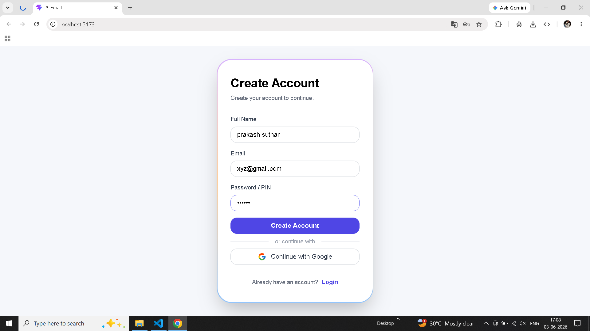
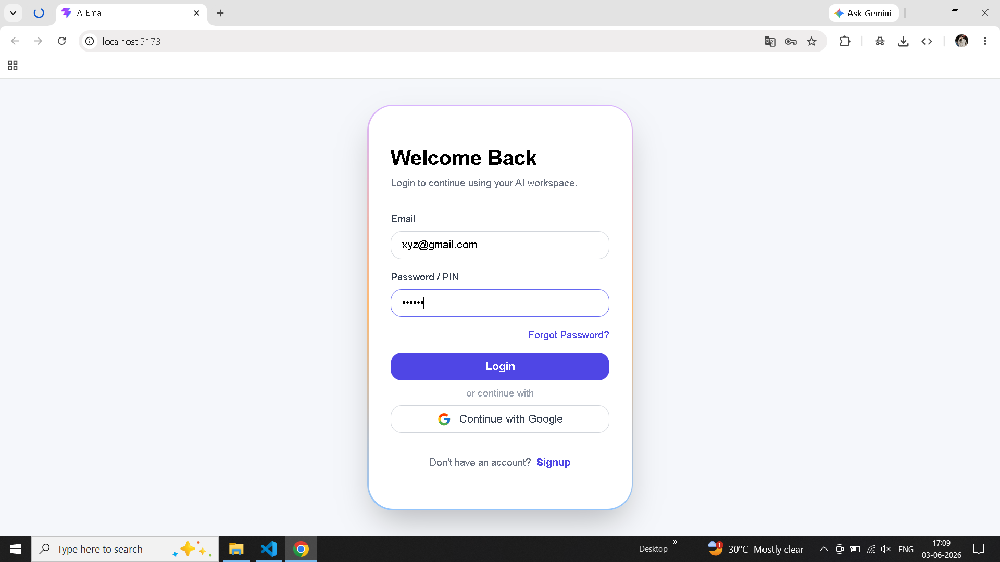
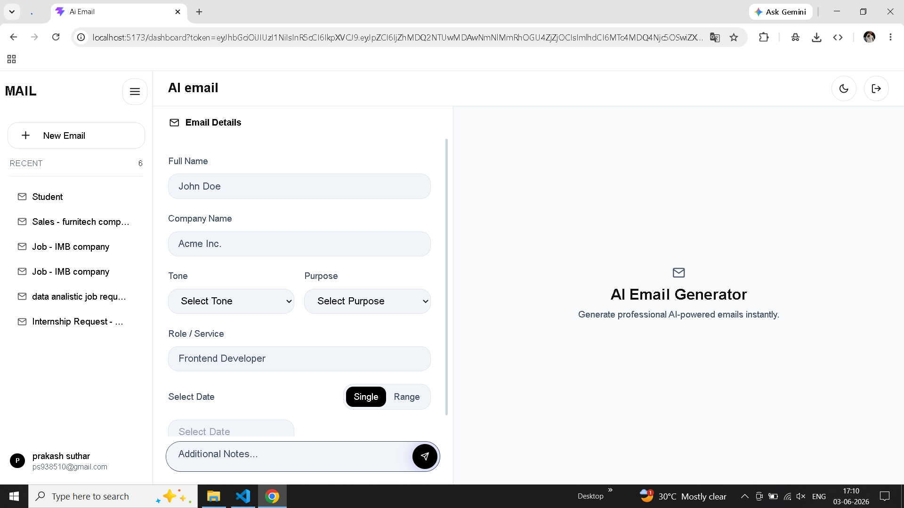
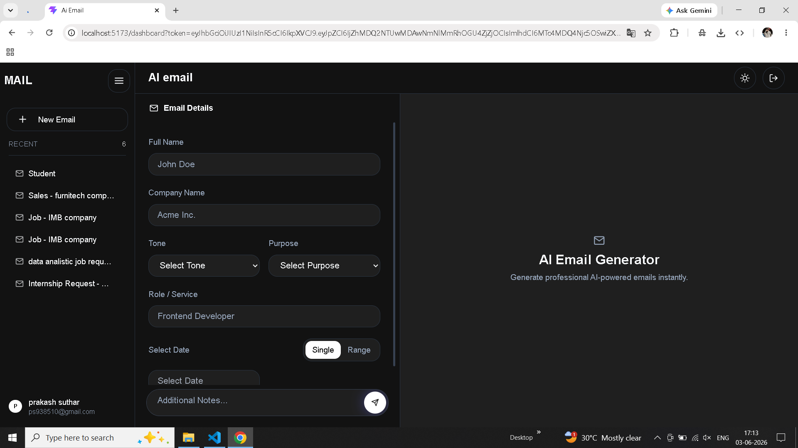
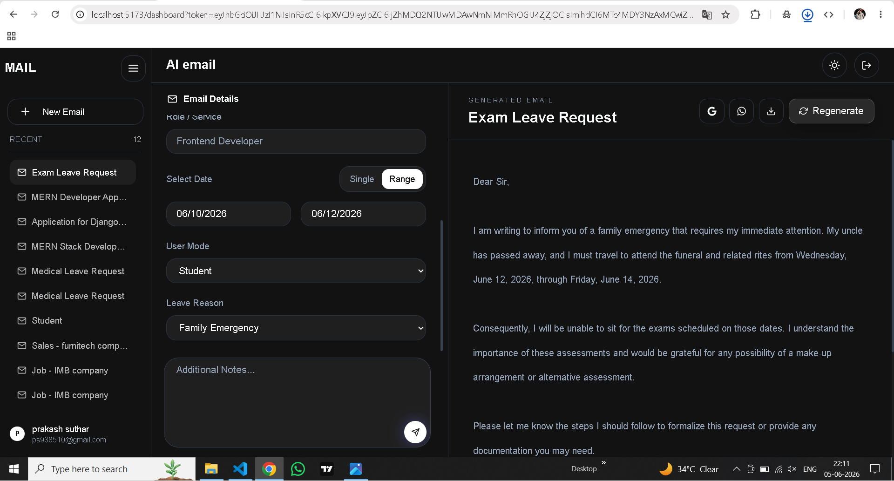
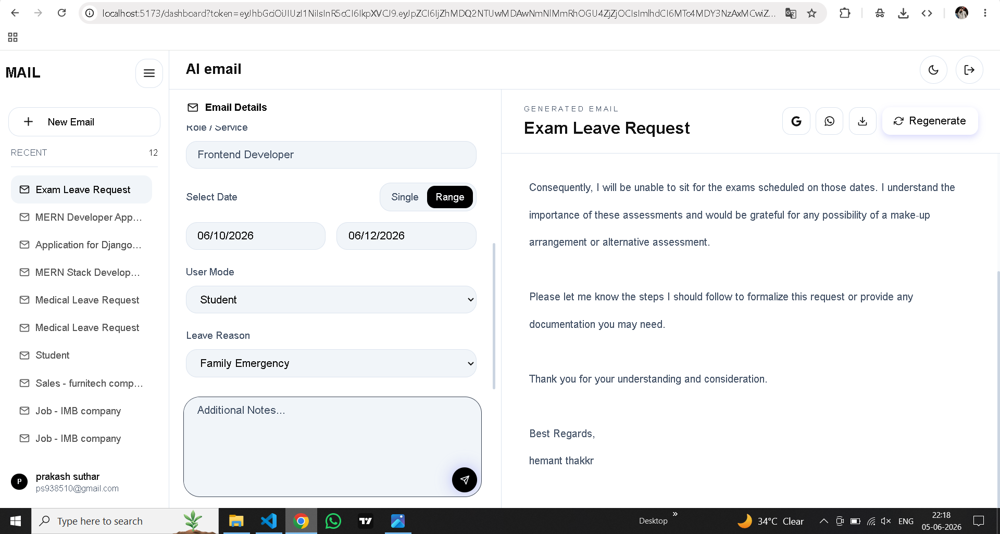

# Cold Email AI 

AI-powered Cold Email Generator built using MERN Stack and OpenRouter AI.

## Features

- Generate professional cold emails using AI
- User Authentication
- OTP Verification
- Email History
- Dark Mode Support
- Responsive UI
- Clean Dashboard Interface

## Tech Stack

### Frontend
- React.js
- Tailwind CSS
- React Router

### Backend
- Node.js
- Express.js

### Database
- MongoDB

### AI Integration
- Open Router API

## Project Structure

```bash
cold-email-ai/
├── client/
├── server/
├── README.md
└── .gitignore
```

### Login Page




### Dashboard




### Email Generator





## Environment Variables

Create a .env file inside the server folder.

```bash
PORT=5000
MONGO_URI=your_mongodb_uri
JWT_SECRET=your_jwt_secret
OPENROUTER_API_KEY=openrouter api key 
EMAIL_USER= for the email sent throu the your email address
EMAIL_PASS= 16digit password of your email 
GOOGLE_CLIENT_ID=google client id 
GOOGLE_CLIENT_SECRET=google client secret 
```

## Installation

### Clone Repository

```bash
git clone https://github.com/prakaashsuthar09/cold-email-ai.git
```

### Frontend Setup

```bash
cd client
npm install
npm run dev
```

### Backend Setup

```bash
cd server
npm install
npm start
```

## Author

Prakash Suthar

GitHub:
https://github.com/prakaashsuthar09
